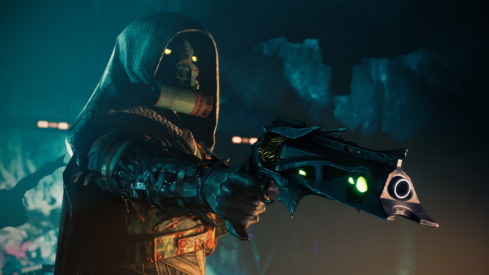

{: .align-center}

Every game designer has that one franchise or one work that has influenced the way they think, whether it be to learn from a works mistakes or to forever appreciate and copy certain elements of a game. For me, that game was the Destiny, and ever since year one of this MMOLite, i’ve been following it with a close eye- I had never played a game I loved and hated at the same time so much before. With the latest, large scale release of Forsaken, it seems that Destiny 2 is regaining much of the charm of the original, vanilla game did away with when transitioning between D1 and D2. But with all the sugar comes some salt. With this essay I hope to highlight the good and the badd of all the new Destiny changes starting at the drop of the Forsaken DLC. 

I always believe in giving credit where credit due. The Destiny franchise, in my opinion, has some the the best feeling shooting mechanics in any game, some of the best feeling class designs, some of the most unique raids, and some of the most fluid gameplay ever. The elephant in the room with the new Forsaken DLC is obviously the death of the fanbase’s favorite character- “Cayde-6”. Destiny has been a game about the serious, philosophical world and in comical contrast- about space magic. An oxymoron inherently, I think Bungie found it hard to make relatable characters for such a unique world, and we definitely see that evidence with every character you meet in the world. Most characters, with a few exceptions, are bland with no relatability and at the worst, obnoxiously rude and stuck up. Forsaken has somewhat fixed that issue in an interesting way. One of the characters from Destiny that has always been regarded as beloved by the fanbase is the poster-boy hunter, “Cayde-6.” A cocky, funny, and lazy hunter who serves the Vanguard (the protectors of the last city) as their hunter representative. In order to do away with the blandness of the character design, Bungie, rather than add lore, and change characters as they were in the game with voice lines like many other narrative design teams would have, sacrificed their poster-boy in order to kick start an event where not only other characters would start showing emotion and personality, but your player (who had stayed mute for the entire franchise so far), said his first words! This solution was creative in the most basic way- give players and NPCs a common goal, or a common thing to hate so that they may grow together. While I really did like the most relatable, funny character in the series, I feel that it was a good trade off. So many different characters, new and returning have shown relatability and a deep, multifaceted personality.

The next topic would be raid design. Destiny has always had two fairly equal halves- PvE and PvP. PvE (player versus environment) is the story based content where players work together to gain loot, and defeat the forces of darkness. PvP (player versus player) has its place in the “Crucible,” which will be discussed later on in this article. Raids have served as the highest level PvE content for a while now. They are the pinnacle of activities that often tie up story lines, and drop exclusive exotics- weapons and armor that are not only the rarest and most powerful, they often change how you play as well! In Destiny 1, each content drop would have a raid that tied up that content’s story line. However, for Destiny 2, Bungie adopted, what is in my opinion, a much more lazy approach called raid layers. The vanilla drop for Destiny 2 dropped a new raid called the leviathan and the room design, the boss design, and the puzzles were just simply fantastic. But come each content drop after that, each DLC pre-forsaken would drop a raid layer- a small change to the bosses and the mechanics in the same raid. This vastly hurt their popularity in the community since there wasn’t any real reason to do the raids past the Leviathan raid- they didn’t offer any new loot worth getting, and they certainly didn’t tie up the story lines. With Forsaken, they dropped an entirely new raid called “Last Wish f tying up the story line, granting unique loot and more just as they once did in D1. Moreover, they have also released (albeit a smaller raid akin to Crota’s End), another new raid with their latest release- Black Armory. Reverting back to the old standards of raids and greatly increased PvE player participation and raid completion rates and also respect for these mechanic based masterpieces.

The other big elephant in the room is PvP. PvP has always been a stalwart part of the Destiny gameplay loop, and can be summarized into- complete PvE content, earn weapons and armor, come to PvP, compete and have fun. Bungie, after an entire year after vanilla release, realized that their previous iteration of PvP in D1 was much more fluid than the vanilla setup so they reverted time to kills and weapon slots back to the way it was. This however didn’t come with its fair share of problems. Forsaken released back in Dec 2018 but even now, as this article is being written in April, 2019, Bungie has not bothered fixing some blatant issues with the sandbox. The excuse, the player base thought, was with the contract that they had with Activision. But now that that contract has been bought out, they don’t have that excuse. 

Before the “Go Fast” PvP update got patched into the game, they greatly decreased the timers between heavy spawn rates (heavy weapons are your one hit kill “noob” weapons- rocket launchers, grenade launchers, machine guns). This was supposed to be a temporary fix as they slowly patched the sandbox to make the entire environment more like D1. And while this was fun for a short while, the player base quickly grew to hate the meta (the main way the game is played). Since heavy spawned every 15 seconds, and only one person could take heavy from either side- it lead to whoever getting heavy dominating the rest of the match. The worst part about this is that even today, clearly after the many patches that the PvP sandbox gets, this isn’t fixed.

The second issue with PvP is the spawn system. When reverting back to their old formula, Bungie decided to make PvP 6v6 again rather than keeping it 4v4. I completely agree with their reasoning, and we can really see the results today- PvP is much healthier in player population and concurrency than it was in year 1. In order to keep the game more dynamic and more fast paced, they added more players means more targets, and as it turns out, 6 is just there right number! It gives us just enough points of contact to have the right balance between always being on your toes and being able to back off and take a breather.

 What they didn’t take into account however is the spawn system. Every class in Destiny has a super- a pinnacle ability that essentially makes you feel like a god for a short while. This can be dropping a purple, explosive space magic nuke on a group of people, or running around the map with an electrified version of Darth Maul’s lightsaber. Now the original plan for PvP was pretty clever- the spawn algorithm (determines where you respawn after death) would tighten the space between enemies if one had their super active. What this means is that if you were running around with the lightsaber (you only had this active for about 10s), enemies would spawn near you, but they’d spawn together- the game essentially fed you free kills for that 10s to give you a hero moment. Why? there were only four players on the map before- it helped supers feel powerful enough to be able to get multi kills. While Bungie fixed the pace of the game by added 2 more players, they didn’t change this system to account for the number of players now in the game. When someone “supers” the game just starts spawning people right next to the super since it doesn’t know where else to put them. There just isn't a need for this system anymore. This combined with the rate at which supers now are active lead to a lot of frustration in the crucible. 

Another issue as mentioned vaguely above is just the level design on the original, vanilla maps. They are small, have plenty of CQC (close quarter combat) and have some medium ranged lanes meant for slightly longer ranged combat. This would have been great for the 4v4 meta. When the sandbox expanded to include six players instead of four on these maps, it led to everyone running around with shotguns and having the game only cater to CQC. This game the regular maps a very very cluttered and scattered feel. 

Personally, I feel FPS games should have “organized chaos.” Take CoD (Call of Duty) as a great example. CoD maps are famous for using chokepoints- specific places on the map that are built for high enemy traffic. These choke points rely on having many lanes (paths in and out) to help attract traffic. The average user on the map will almost subconsciously abuse this design to “farm” kills, leading to what I call “organized chaos”. Ever pre-fire or throw a grenade into a room in a CoD game just knowing there was going to be an enemy around the corner, without even looking at a radar? It might have been because your brain has trained itself to look at this area on the map as a chokepoint!

Back to D2- when it was originally launched, the maps were made small enough to account for traffic on these “chokepoints” for four players, but the more players you add the more chaos there will be. This led to many odd, and weird chokepoints developing around the map where they shouldn’t be. Chokepoints that aren’t designed to be there are bad because they lead to unfair engagements that have nothing to do with player skill. In general, with game design, you really shouldn’t punish a player when they haven’t done something wrong. In the current D2 PvP, you can do everything right, cover all your corners and still die to someone spawning behind you, or someone just ape-ing you. Think about it

Don’t get me wrong- I love CQC, ape-ing and “noob” style gameplay just as much as the next person. However, I also think games should follow universal design and have some amount of emergent gameplay. Universal design is a design point that states that a game or product should cater to all kinds of players. As to who these players are, that demographic can be determined by media analytics and more gameplay statistics that are tracked (in our case with the Destiny 2 open source API). Emergent gameplay is an interesting, more modern game design theory that states that players should be able to discover, create and modify existent gameplay loops to better suit their needs. Emergent gameplay, hence, are gameplay loops that emerge from within the community, rather than the game developer. Some classic examples include the Halo game mode “Grif ball,” or on a much smaller scale- user made builds that “break the meta”, or even finding an odd place on a map to give you an advantage to shoot down from. 

In essence, I think that there should be some kind of counter play. Having one style of play dominating the meta is just not fair to the rest of the player base. Destiny has historically had an issue with balance in its crucible meta- some classes just dominated and more famously some weapon types were just unfair. The biggest contenders for this were shotguns and snipers, and bungie has historically been afraid of snipers as a weapon class. The two however are very good counters for each other. Unfortunately, the new D2 design of maps and with with Bungie’s blatant preference of shotguns in the meta, leads to a very stale and one sided argument in terms of playstyle. It’s actually rare to find variance in the crucible when it comes to weapons used and armor used, and that’s sad when you look at how unique some of the weapons and armors are!

All in all, Forsaken has definitely given the players more good than it has pain but at the same time, so much of the pain can be attributed just to negligence. More than anything, I think the many of the player’s frustration can be attributed to the lack of support, lack of meaningful patches and lack of concern addressing rather than pure fundamental flaws in design. I have a staunch feeling that if Bungie regularly gave us more meaningful sandbox updates and bug fixes, we’d have a much better outlook on the game as a whole- and given Bungie’s new 10million dollar grant from Chinese company NetEase, we might not see the changes and patch regularity that we want. But, comparing the game to its vanilla state, Forsaken has definitely seen the starting resurgence of the Destiny franchise.
