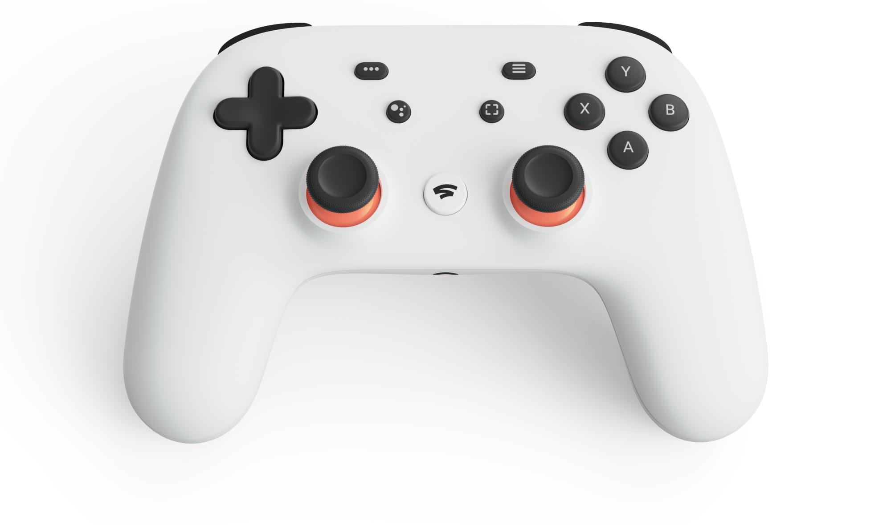

{: .align-center}

Google Stadia is the tech giant’s new entry into the gaming market, and with Scarlet and the new PS5’s information all but given to us it’s actually impressive that the new platform still seems very enticing from a consumer perspective?

What exactly is Stadia? Well from our end (the consumer), you pay un unstated fee and all you get is a really nifty controller, and by all means that controller feels really good. Personally, I have issues with the PS controller. With RSI, many gaming controller just make my wrists and forearms ache after a while, and sometimes if it’s long raid sessions in a game, my forearm actually swells up. The Stadia controller from what I’ve seen, and heard, is supposed to be designed with ergonomics and portability in mind. Now, asking why the portability- Stadia is not a box, all you get is a controller. 

Using Google’s vast network of data centers, Stadia is a cloud gaming platform. What that means is that instead of using your onboard chipset and graphics card in your computer or an xbox one or in a PS4, Stadia (Like scarlet etc…) uses google’s data centers to process video and uses your internet to stream directly to your pc. The result is shared resources resulting in theoretically better compute and processing power since Google’s data centers are much, much, much more powerful than the PCs we have at home. 

Now, the more experienced developers always scoff at cloud gaming, not because of any inherent flaws in the system- most developers will agree that from a compute standpoint, data centers are where we want to be. The key issue is latency. Latency issues can break immersion from a design standpoint- your controller is what keeps you connected and immersed in your game. 

You have control over your in game character purely because you have almost no latency issues. Imagine playing call of duty and losing because it takes a whole second to transmit your input to a datacenter using your internet! In fact, most competitive gamers will use mechanical keyboards and wired controllers purely because of latency- at high tiers of competition even a fraction of reaction time can give you an advantage!

Google believes it can solve this issue by hitting the key points of latency blockers. Latency is caused by your router and the medium that signal is being transmitted to the ISP. This could be an issue considering how (other than cities) most places don’t have optical fiber connections- they still work on older mediums. By getting rid of both of these things- the Stadia controller directly connects to Google datacenter bypassing both issues altogether. Theoretically, this could be a very viable solution to the latency issue ushering in a better, more powerful and immersive graphics scene in gaming. All that’s left to be seen is a title line up for the new stadia service. 
