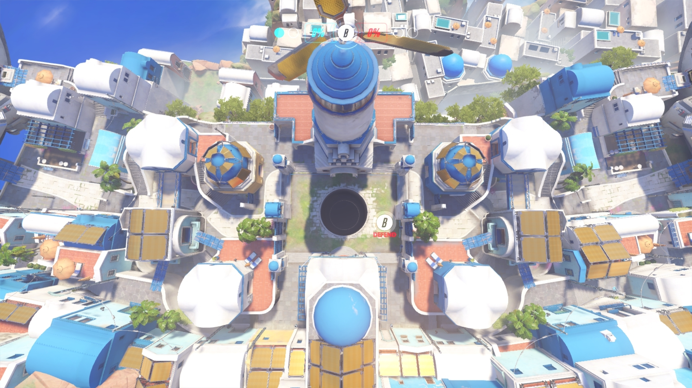

In this post I wanted to detail some of my thought processes on building a level for 
So without overloading myself, I wanted to build a custom map for Cypher considering the game mode. The given requirements that I could think of off the top of my head was that: 

* The map has to be symetrical from spawn to spawn since the teams are going to be competing for single central objective
* Since this is going to be a base map, I want it to support all future mechanics and weirdeness I might add- it needs to be robust. 
* On a similar vein, universal design- all playstyles whether it be CQC or ranged need to be supported
* Multiple paths to a single area (especially to the objective) thereby increasing the complexity in game
    * Different paths should have differnet kinds of engagements making interactions unique
* Chokepoints should be a major focus since I need to encourage where teams will pinch and push to
* We need to remember the scoping for the map- 3v3

One big point here is that symetrical maps can be extremely boring in how they perform because there isnt anything special to fight against in terms of map uniqueness. By looking at maps with very interesting chokepoints and interactions, I need to incorporate ideas like those into my map to make these "boring" symetrical maps "fun!" 

{: .align-center}

Take Ilios from overwatch as an example- the map is almost perfectly symetrical, but the huge pit at the center of the map creates a very interesting use of space. This especially contributes to the unique fun factor of the map considering pulls, CC and other abilities can push heros into the pit scoring an instant elimination. Another big point to that map are the sniper's nests- the nests at the top of the building make you think twice before moving to score a pit kill. The perches are directly below a chokepoint, making it hard to stay there for an extended period of time- there are multiple ways to kill the sniper. The CQC chokepoint is balanced by the fact that, in order to kill the enemy sniper you need to make your way closer to the enemy spawn. All of this gives the map that should have been a boring symetrical map with just a single central "cornucopia" a very interesting set of dynamics and a very unique feel. 

Now obviously for the sake of this project, reinventing the wheel wasn't a good thing- making some fresh and unique like the above is just as hard as it sounds. I didn't want to give myself the task of designing an terribly complex map early on in the pipeline since I really have no experience getting the networking part of this project working. However, I didn't want to just go to the asset store and find a random symetrical map and use it- I definitely want to think of adding a unique style to Cypher, something that makes Cypher's visuals and levels feel like Cypher. Also I felt that adding a tailored map would be a crucial point to making the gamemode feel unique and "fun."  

Based on the above conclusions, I decided to take a good long look at some of my favorite maps in competitive FPS gaming and I found some gems. If you've known me or known of me, you'll know I have a huge love hate relationship with Destiny. One of my favorite maps there was called Patheon- here is a top down view of it before I continue: 

{: .align-center}

So Patheon, interestingly enough, was actually a relatively small map for D1. It was fairly symetrical and actually did a very good job of having interesting encounters in different areas. Waterfall used to look down into cube so you had a great vantage point there and that entire area used to be a great flank point for that alley right next to it. But to balance that out, you had to shoot through a waterfall and considering how fast paced destiny was, it took a lot of skill to be able to pull that off. But, one crucial failing of patheon in my opinion is the lack of inherent map based support for CQC (close quarter combat) gameplay. Now, we used shotties all the time because they were broken but that's a different issue. Outside especially felt like it was supposed to be the interesting flank route that went wrong. Bridge functioned as one entry point to special that actually worked. Outside felt too open and long to be used well- the only time I remember having fun there was dealing with the once or twice a game heavy crate that spawned there. 

Team fortress 2 was another game I played alot. The trading system combined with the chill multiplayer vibe saw me putting way to much time into the game. Here is a map I seriously enjoyed playing all the time:

{: .align-center}

While this map wasn't always perfectly balanced symetrically it did have some interesting dynamics similar to Pantheon- a very cool dynamic between flank routes and CQC and sniper lanes. This was super nice to look at considering how varied the classes were in TF2. It was super nice to see how I could look at the map and see immediately where a class would have control over the map or where they would be powerful.

Once again these were just some maps I felt like I could relate to while making the map for Cypher. Stay tuned for more updates on my actual level!

